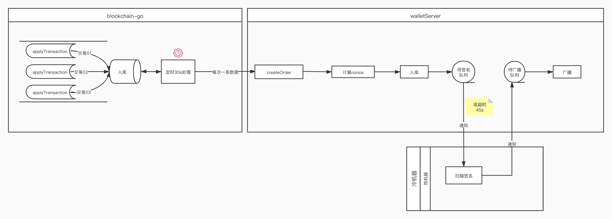
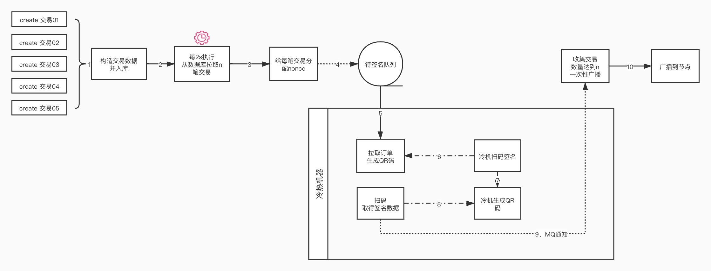
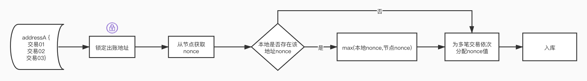

## 现有流程和问题

#### 流程描述：
待补充

#### 存在问题：
待补充

# ETH出账流程优化方案（初）

> 主要讨论的场景是ETH和ERC20同一出账地址同时多笔交易的情况，由于各种因素，所以优化的原则是尽量不要大改动，以免影响到现有的功能。所以有些地方可能会为了兼顾两边做一些妥协。有些地方可能考虑不周，需要大家一起多多探讨~
>

上图是一个初步的修改方案，入口是walletserver系统`/eth/create`，主要描述**同一地址同时出账多笔交易**的场景。

主要的想法是每次从数据库拉取n笔交易，在本地为n笔交易分配连续的nonce值，入队列等待扫码签名，然后等待签名完成通知（通过MQ），当n笔交易签名通知全部都返回，一次性广播出去，这样一个流程可以叫作一轮。注意这里整个流程非并发，只有一个goroutine来执行。

当然上面是没有出错的情况，如果在等待签名阶段突然某一笔交易签名失败，可以根据策略做决定：1）重新计算nonce签名，2）失败订单重新入队列，继续等，3）如果满足条件先广播已签名交易，当前失败订单重入队列。关于出错后如何处理是比较复杂的，下面有专门做讨论。

因为是批量处理，一次性广播，所以即使最坏情况需要全部重新计算nonce值，也可以在极短时间内完成。

上图也只是列出了关键的步骤，下面对每个步骤进行详细讨论。

### Step1 构造交易数据，并入库

交易数据构造流程和原来差不多，但是这一步不需要计算nonce。

**这里面有一个很重要的步骤：检查余额是否足够。**这里主要考虑的是节点存在一些pending的交易，然后当前系统又进来相同出账账号的交易，这时候查询的余额是不对的，这个问题好像现在版本也会有，解决方法待讨论//TODO。

### Step2 每2s执行，从数据库拉取n笔交易

这里n需要调整后才能知道，太多会导致如果某一笔出现失败的情况，会拖长执行的时间，太少效率低下。

### Step3 给每笔交易分配nonce

这里展示多笔交易如何分配nonce的过程：

1. 锁定出账地址，如果考虑集群做成分布式锁将功能剥离出去，如果单机好像没必要锁？
2. 从节点获取nonce，其实我们是自己管理地址的nonce值
3. 本地维护了一个以出账地址为key的Map结构，保存当前最新的nonce
4. 第2步从节点获取的nonce和本地Map的nonce比较，取较大的值
5. 为多笔交易分配连续的nonce
6. 将数据存回数据库，等待签名

### Step4-9 交易签名流程

不变，与当前版本保持一致

### Step10 收集交易数量达到n一次性广播

需要一个Map结构保持本轮执行的交易，可以在Step3把交易数据存入Map，然后每次收到MQ通知，都去Map查找，如果存在就标记为已签名。如果Map里面的交易已全部签名完毕，则一次性广播出去。

## 签名失败情况讨论

首先说下目前系统是如何处理签名失败的情况，程序会启动一个goroutine专门来处理超时交易，每3s执行一次，逻辑是直接遍历正在待签名的队列，如果发现超过45s（只讨论ETH）了交易还在队列，证明还没被处理，就会直接从队列删除该交易，修改数据库状态为超时，回调业务系统告诉它交易超时（具体怎么回调不清楚），然后业务系统可能会再重新发起请求过来，再走一遍。

也就是说，目前是以是否超时来判断签名成功还是失败，这里个问题直接使用45s来判断太暴力了，现在估计几笔交易就基本会出现超时。

但是以上流程建议还是继续使用，以免改了其他地方出问题，新的超时判断流程只用作ETH。

新的方案我的想法是判断超时的值不应该是绝对值，考虑使用相对值，每隔一秒执行一次，读取当前待签名队列的第一个元素，记录这个元素和当前的时间，如果队列的第一个元素更换了，重新记录元素和时间。如果超过了`a`
秒依然没有更换第一个元素，表示扫码已经超时了。

将交易从队列里删除，根据实际情况做不同处理，下面以本轮处理5笔交易为例：

1. 如果一笔都没有签名成功，直接全部再放入待签名队列
2. 判断签名成功的交易nonce值是否5笔交易中最小的值，如果是，可以直接广播，然后再看nonce+1的交易是否也成功，成功直接广播。
3. 如果最小nonce值得交易签名失败，全部重新签名，然后再放入待签名队列
4. 考虑记录交易的重试次数，如果达到一定次数依然失败，修改数据状态，发送钉钉（其实就是现在的流程）

